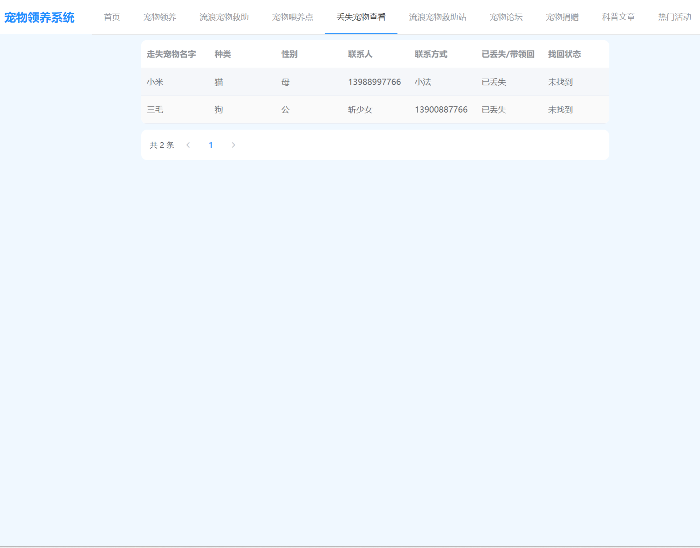

### 作者QQ：1556708905(支持修改、 部署调试、 支持代做毕设)

#### 支持代做任何毕设论、接网站建设、小程序、H5、APP、各种系统等

**毕业设计所有选题地址 [https://github.com/zhengjianzhong0107/allProject](https://github.com/zhengjianzhong0107/allProject)**

**博客地址：
[https://blog.csdn.net/2303_76227485/article/details/131959107](https://blog.csdn.net/2303_76227485/article/details/131959107)**

**视频演示：
[https://www.bilibili.com/video/BV1yc411w79s/](https://www.bilibili.com/video/BV1yc411w79s/)**

 

## 基于Java+Springboot+Vue的宠物领养系统(源代码+数据库+14000字论文)091

## 一、系统介绍

本项目前后端分离

本系统分为管理员、用户两种角色

用户角色包含以下功能：

- 登录、注册、首页、宠物喂养、流浪宠物救助、宠物喂养点、丢失宠物查看、流浪宠物救助站、宠物论坛、宠物捐赠、科普文章和热门活动、个人中心、密码修改

管理员角色包含以下功能：

- 登录、主页、系统管理（用户管理、角色管理、菜单管理、文件管理）、流浪动物管理、待绝育动物管理、申请领养管理、评论管理、流浪动物救助管理、
- 喂养点管理、动物走失管理、救助站管理、帖子管理、捐赠管理、公告管理、科普文章管理和活动管理、个人中心、密码修改

## 二、所用技术

后端技术栈：

- Springboot
- MybatisPlus
- Mysql
- Jwt

前端技术栈：

- Vue
- Axios
- VueRouter
  
  ## 三、环境介绍
  
  基础环境 :IDEA/eclipse, JDK1.8, Mysql5.7及以上,Node.js(14),Maven3.6

所有项目以及源代码本人均调试运行无问题 可支持远程调试运行

## 四、项目截图

### 1、功能结构

### 2、文档目录

### 3、用户页面

### 4、管理员页面

## 五、浏览地址

访问地址：http://localhost:8080/login

- 用户账号/密码：zhangsan/123456
- 管理员账号/密码：admin/admin

## 六、部署教程

1. 使用Navicat或者其它工具，在mysql中创建对应名称的数据库，并执行项目的sql文件；

2. 使用IDEA/Eclipse导入petAdopt项目，若为maven项目请选择maven，等待依赖下载完成；

3. 进入src/main/resources修改application.yml 里面的数据库配置、文件目录地址(files的绝对路径)

4. src/main/java/com/example/petparent/SpringbootApplication.java 启动项目

5. vscode或idea打开vue项目，

6. 在编译器中打开terminal，执行npm install 依赖下载完成后执行 npm run serve,执行成功后会显示访问地址

 
